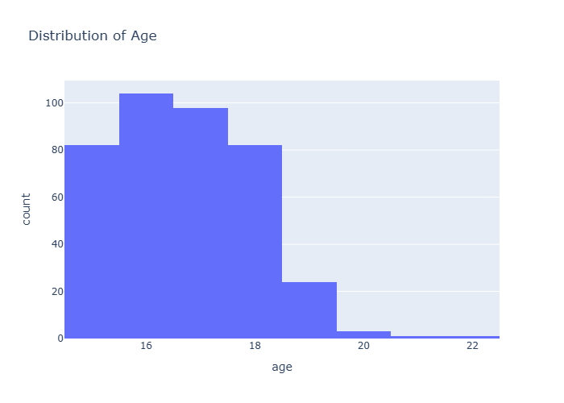
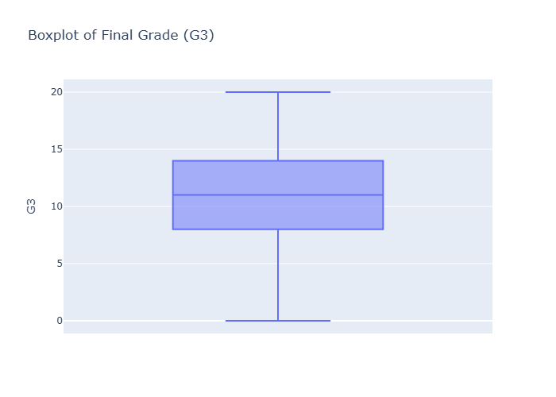

# Student Data Dashboard

This project provides an **interactive dashboard** built with [Dash](https://dash.plotly.com/) and [Plotly](https://plotly.com/python/) to analyze student performance data.  
It uses a dataset (`student_data.csv`) that includes student demographics, study habits, and final grades.

---

## Features

- Data cleaning (handling missing values and duplicates).  
- Interactive dashboard with **6 different charts**:  
  1. Distribution of Age (Histogram)  
  2. Boxplot of Final Grade (G3)  
  3. Study Time vs Final Grade (Scatter plot, colored by Gender)  
  4. Average Final Grade by School (Bar chart)  
  5. Distribution of Students by Address (Pie chart)  
  6. Absences vs Final Grade (Line chart)  

- Automatic export of charts as `.png` images (requires [kaleido](https://pypi.org/project/kaleido/)).

---

## Installation

1. Clone this repository:

   ```bash
   git clone https://github.com/YOUR_USERNAME/student-dashboard.git
   cd student-dashboard
   ```

2. Install required packages:

   ```bash
   pip install -r requirements.txt
   ```

3. Run the app:

   ```bash
   python studentdata.py
   ```

4. Open your browser and navigate to:

   ```
   http://127.0.0.1:8050/
   ```

---

## Requirements

- Python 3.8+  
- [pandas](https://pandas.pydata.org/)  
- [plotly](https://plotly.com/python/)  
- [dash](https://dash.plotly.com/)  
- [kaleido](https://github.com/plotly/Kaleido)  

---

## Example Output

The dashboard includes charts like these (saved in `.png` format in the project folder):

-   
-   

---

